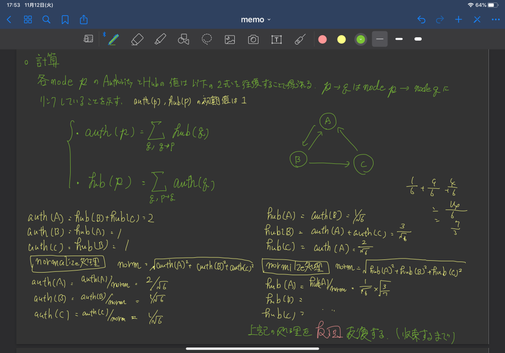
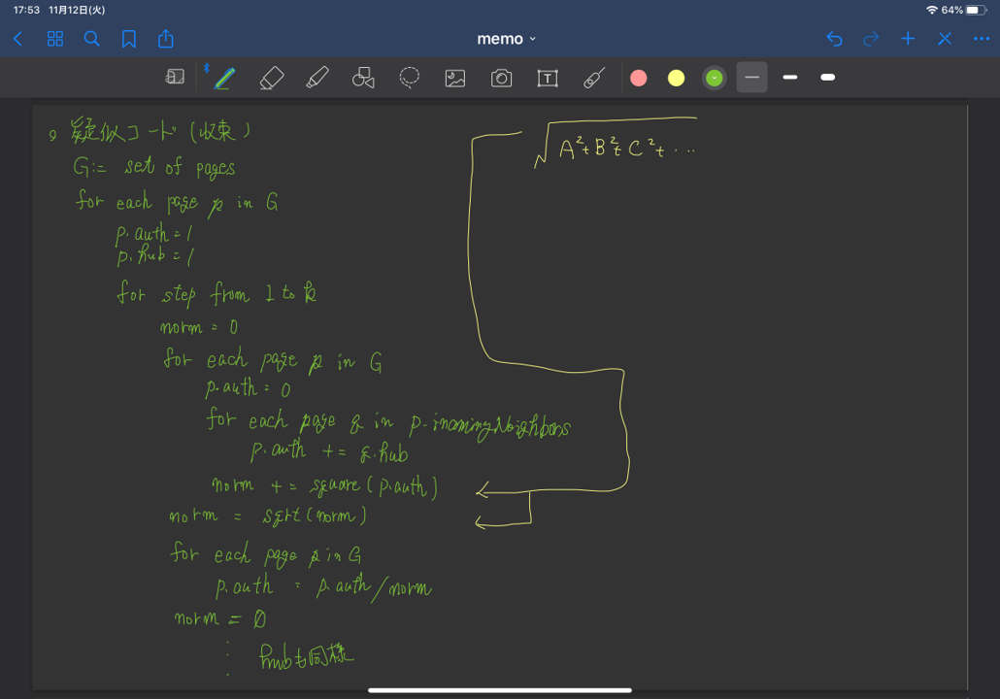
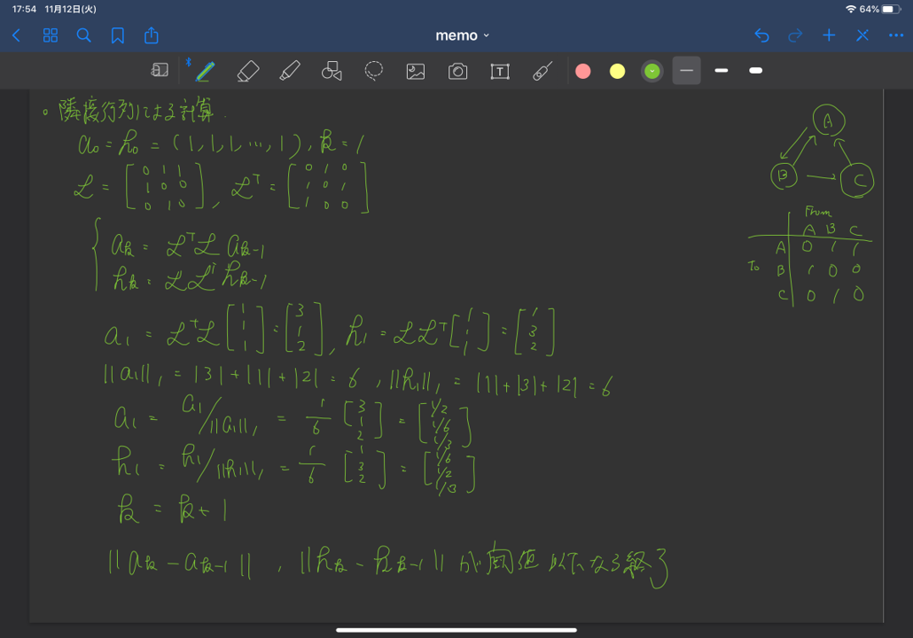

# HITS

HITS(Hyperlink-Induced Topic Search)はJon Kleinbergが開発したWebページを評価するアルゴリズムです．

勉強も兼ねてnetworkxのhits functionを使用しないHITS algorithmを実装するリポジトリ．

## 参考リンク

- [Kleinberg, J. M. (1997). Authoritative Sources in a Hyperlinked Environment .](https://www.cs.cornell.edu/home/kleinber/auth.pdf)
- [Wikipedia[en]「HITS algorithm」](https://en.wikipedia.org/wiki/HITS_algorithm#cite_note-1)
- [Web Data Mining: Exploring Hyperlinks, Contents, and Usage Data (Data-Centric Systems and Applications)](https://www.amazon.co.jp/Web-Data-Mining-Data-Centric-Applications/dp/3642194591)
- [naoyaのはてなダイアリー「HITS, 主成分分析, SVD」](https://naoya-2.hatenadiary.org/entry/20090301/hits)
- [マイムの部屋「HITSアルゴリズム」](http://mimuuow.hatenablog.com/entry/2015/10/28/113539)
- [networkx「hits」](https://networkx.github.io/documentation/networkx-1.9.1/reference/generated/networkx.algorithms.link_analysis.hits_alg.hits.html)
- [GeeksforGeeks「Hyperlink Induced Topic Search (HITS) Algorithm using Networxx Module | Python」](https://www.geeksforgeeks.org/hyperlink-induced-topic-search-hits-algorithm-using-networxx-module-python/)

## Environment

- Python 3.7.3
  - matplotlib                         3.1.0
  - numpy                              1.16.4
  - pandas                             0.24.2
  - networkx                           2.3
  - pprint                             0.1

## Sampleネットワーク


```
隣接行列

   A  B  C  D  E  F  G  H
A  0  0  0  1  0  0  0  0
B  0  0  1  0  1  0  0  0
C  1  0  0  0  0  0  0  1
D  0  0  1  0  0  0  0  0
E  0  1  1  1  0  1  0  0
F  0  1  0  0  0  0  0  0
G  1  0  1  0  0  0  0  0
H  1  0  0  0  0  0  0  0
```

Network xでの実行結果(iter=60,normalize=true)

```
'Authority Scores'
{'A': 0.12259059198121637,
 'B': 0.15938748867805191,
 'C': 0.33351811426192646,
 'D': 0.15938748867805191,
 'E': 0.06773750229574053,
 'F': 0.13248067440906394,
 'G': 0.0,
 'H': 0.02489813969594891}

'Hub Scores'
{'A': 0.062151232534615714,
 'B': 0.1564647974400908,
 'C': 0.05751145547702772,
 'D': 0.13005137383066068,
 'E': 0.30601308310927944,
 'F': 0.062151232534615714,
 'G': 0.17785409945218528,
 'H': 0.04780272562152461}
```

hits_algoritm.pyのcalc_hits_algorithmでの結果(iter=60,normalize=true)

(実際はndarrayが返される)

```
'Result'
   authority      hubs
A   0.122591  0.062151
B   0.159387  0.156465
C   0.333518  0.057511
D   0.159387  0.130051
E   0.067738  0.306013
F   0.132481  0.062151
G   0.000000  0.177854
H   0.024898  0.047803
```

## Note





